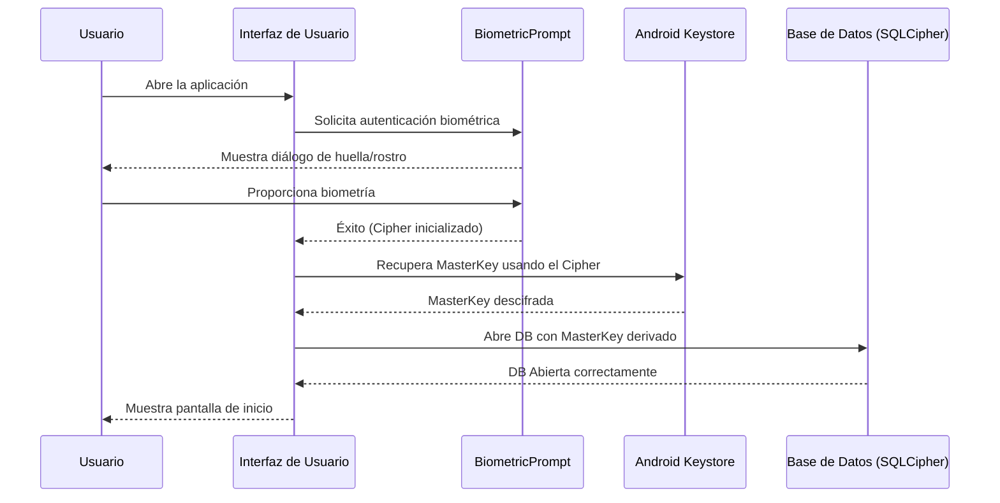

# Gestión de Claves y Seguridad de Datos (ISO 27001 / Ley 1581)

## 1. Introducción
Este documento describe el ciclo de vida de las claves criptográficas utilizadas en SigeSchool Pro para proteger la información sensible de los estudiantes, docentes y acudientes.

## 2. Generación de Claves
### 2.1 Android (Android Keystore)
Se utiliza el **Android Keystore System** para generar una clave maestra AES-256 (`MasterKey`).
- **Algoritmo:** AES/GCM/NoPadding
- **Tamaño:** 256 bits
- **Protección:** Requiere autenticación biométrica o PIN del dispositivo para acceder a la clave.
- **Persistencia:** Las claves se almacenan en hardware seguro (TEE - Trusted Execution Environment) si está disponible en el dispositivo.

### 2.2 Desktop
En plataformas Desktop, se integra con los gestores de credenciales del sistema operativo:
- **Windows:** Windows Credential Manager.
- **macOS:** Keychain Services.
- **Linux:** Secret Service API (libsecret).

## 3. Derivación de Clave para SQLCipher
La clave maestra no se usa directamente para abrir la base de datos. Se deriva una clave de sesión:
1. Se recupera la `MasterKey` del Keystore/Keychain.
2. Se utiliza un **Salt** único almacenado en las preferencias encriptadas.
3. Se aplica **PBKDF2** con 10,000 iteraciones (mínimo recomendado por NIST).

## 4. Diagrama de Flujo (Autenticación y Desbloqueo)

## 5. Rotación y Revocación
- Las claves se revocan si se detecta que el dispositivo ha sido comprometido (Root/Jailbreak).
- La rotación de claves se realiza anualmente o ante una posible brecha de seguridad mediante un proceso de re-encriptación de la base de datos.

## 6. Cumplimiento Ley 1581
SigeSchool Pro garantiza que:
- Los datos personales están cifrados en reposo (At-rest).
- El acceso está restringido por roles.
- Se mantiene un log de auditoría inmutable de todos los accesos a datos sensibles.
